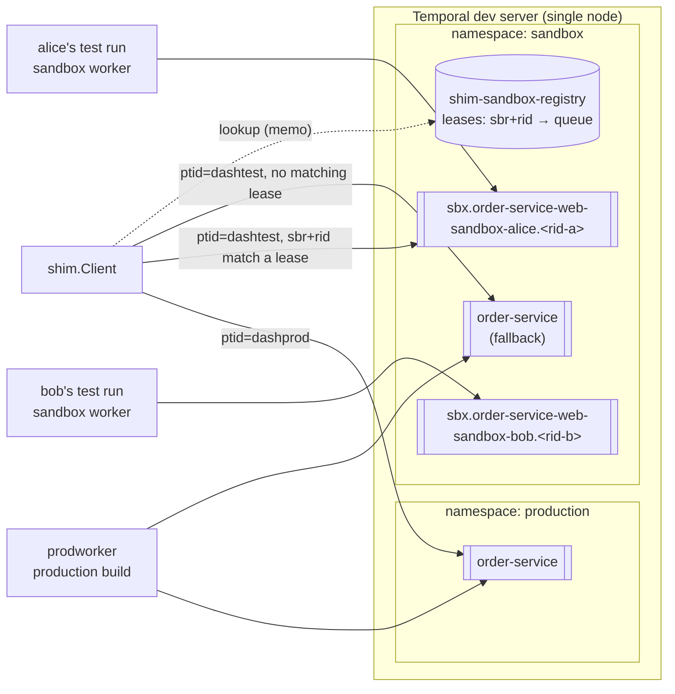
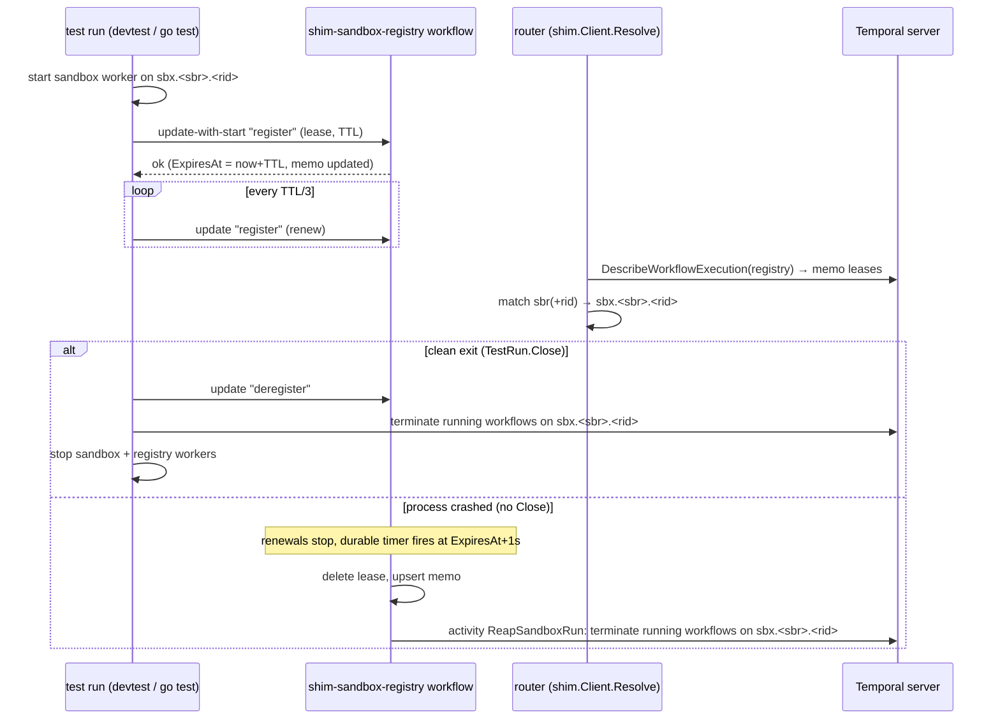

# Temporal sandbox routing POC (Go SDK)

This POC puts production and per-developer sandbox traffic on **one Temporal cluster**. Routing is driven
entirely by OpenTelemetry baggage, and a thin shim over the Go SDK does the work:

| baggage | meaning | effect |
|---|---|---|
| `ptid` | Pedregal tenant ID: `dashprod` or `dashtest` | picks the namespace: `production` or `sandbox` |
| `sbr`  | sandbox routing key: `<service>-<app>-sandbox-<name>`, e.g. `order-service-web-sandbox-alice` | picks a developer's sandbox |
| `rid`  | run ID, generated by the shim for each test run | `sbr`+`rid` pick the run's own task queue, workers and workflows |



## Quick start

```bash
make server        # terminal 1: dev server with `production` + `sandbox` namespaces and Ptid/Sbr/Rid search attributes
```

```bash
make test          # unit tests + e2e tests against the dev server
```

```bash
make demo          # multi-process demo: prod worker, gRPC server, alice + bob + prod + unrouted traffic at once
```

UI: http://localhost:8233. Switch between the `production` and `sandbox` namespaces, and filter on `Sbr`/`Rid`.

## What `make demo` runs and validates

`make demo` runs [scripts/demo.sh](scripts/demo.sh). It needs `make server` running in another terminal.
It builds the four binaries into `bin/` and runs them as separate OS processes, just as separate services and
developer laptops would. Each process writes a log to `.demo-logs/<name>.log`, and the script prints the
interesting ones as it goes.

### Setup: the long-running services

| process | log | what it is |
|---|---|---|
| `bin/inventory` | `inventory.log` | Downstream gRPC service on `127.0.0.1:50051`. `Reserve` replies with the baggage it saw in the incoming gRPC metadata, so the caller can prove propagation across the network hop. |
| `bin/prodworker` | `prodworker.log` | The **production deployment** of `order-service`. It runs three workers: `production`/`order-service` (admits only `dashprod`), `sandbox`/`order-service` (the production build serving `dashtest` traffic that has no matching sandbox), and `sandbox`/`shim-sandbox-registry` (hosts the sandbox registry workflow). It also runs a Kafka consumer that logs the baggage on every `order-events` record. |

The script waits 2 seconds for them to start. On exit, its `trap` kills every background process it started.

### The order scenario (run once per traffic source)

Steps 1 and 2 send traffic through `order.RunScenario`, which uses only `shim.Client` and the baggage on
`ctx`. The caller never names a namespace or task queue. For order ID `N`, the scenario does this:

1. **Resolve**: `Client.Resolve` picks the namespace and task queue from the baggage. The decision and the
   reason for it are printed as the header of each table.
2. **Start** workflow `order-N`. For `dashtest` traffic that carries a `rid`, the shim turns the ID into
   `order-N@<rid>`. That is why several runs can use the same order ID without colliding.
3. Inside the workflow (generation 0):
   - **`workflow-start`**: records the baggage decoded from the start header.
   - **`activity:ReserveInventory`** makes an outbound **gRPC** call to `bin/inventory`. That produces two rows:
     the baggage the activity saw, and the baggage the gRPC server saw (`grpc:inventory.Reserve`).
   - **`activity:PublishOrderEvent:reserved`** produces a **Kafka** record with the baggage in its headers.
   - Starts the **child workflow** `PaymentWorkflow` (ID `payment-N`, also scoped per run). It records
     `child:workflow-start` and runs `child:activity:ChargePayment`.
   - Blocks until it receives the `approve` signal.
4. The client sends **update** `add-item("fries")` and waits for it to complete. The handler records the
   baggage from the update's *own* header (`update:add-item`).
5. The client sends **query** `hops`. The handler returns the baggage from the query's *own* header. The client
   adds it as the last row, `query:hops`.
6. The client sends **signal** `approve`. The workflow records the baggage from the signal's own header
   (`signal:approve`).
7. The workflow waits for its handlers to finish, then **continues-as-new**. Generation 1 records
   `gen1:workflow-start`, which shows the baggage survived continue-as-new. It then publishes a second Kafka
   record (`PublishOrderEvent:completed`) and completes.
8. The client waits on the result with an empty run ID, so the handle follows the continue-as-new chain.
   The returned hop list is printed as a table.

How to read the table columns:

| column | meaning |
|---|---|
| `PTID`, `SBR`, `RID` | the baggage observed at that hop |
| `NAMESPACE`, `TASK QUEUE` | where the hop actually ran, taken from `workflow.GetInfo` / `activity.GetInfo`. It is `-` for hops outside Temporal (the gRPC server, the query row) |
| `WORKER` | identity of the worker that ran the activity: `prod/<namespace>/order-service@host:pid` or `sandbox/<sbr>/<rid>@host:pid`. On the gRPC row it is the inventory server's name |

Rows appear in the order the workflow recorded them. The update usually lands right after the start, while the
first activity is still running.

### Step 1: two developers, production and unrouted test traffic, all at once

Four processes start at the same moment, and every one of them uses order ID **1001**:

| process | baggage | expected route | expected worker | checked automatically? |
|---|---|---|---|---|
| `devtest -name alice` | `dashtest`, `sbr=order-service-web-sandbox-alice`, fresh `rid` | `sandbox` / `sbx.order-service-web-sandbox-alice.<rid>` | alice's own sandbox worker | **yes** |
| `devtest -name bob` | `dashtest`, `sbr=order-service-web-sandbox-bob`, fresh `rid` | `sandbox` / `sbx.order-service-web-sandbox-bob.<rid>` | bob's own sandbox worker | **yes** |
| `starter -ptid dashprod` | `dashprod` | `production` / `order-service` | `prod/production/order-service@…` | no (read the table) |
| `starter -ptid dashtest -sbr …-carol` | `dashtest`, `sbr` for carol, no `rid` | `sandbox` / `order-service`: carol has no running sandbox, so traffic falls back to production workers | `prod/sandbox/order-service@…` | no (read the table) |

Each `devtest` process plays one developer's test run:
1. `Client.StartTestRun` generates a `rid` and creates the task queue `sbx.<sbr>.<rid>`.
2. It starts a sandbox worker that polls **only** that queue. The worker has the same workflows and
   activities registered as production, plus a guard that admits only this exact `sbr`+`rid`.
3. It registers a lease in the registry, and only after the worker is polling.
4. It runs the scenario once with `TestRun.Context(ctx)`, then validates it with `order.Verify`. Every hop
   must:
   - carry exactly the run's `ptid`/`sbr`/`rid` (the gRPC server and query hops included);
   - have run in namespace `sandbox` and on the run's own task queue;
   - for activities (child activity included), have run on the run's own worker identity;
   - and all eight hop kinds must be present: workflow start, activity, gRPC, child, update, query, signal,
     and after continue-as-new.
5. It prints `OK: every hop carried … and ran on …`, or one `FAIL …` line per violated check (and then
   exits non-zero).
6. On exit it calls `TestRun.Close`, which withdraws the lease, terminates any workflow still open on the
   queue, and stops the worker. It then prints `cleaned up run <rid>`.

What step 1 shows:
- **Concurrent developers don't interfere.** Alice's and bob's tables show only their own `sbr`/`rid`, task
  queue and worker, and they ran at the same time as each other and as production.
- **Production never touches sandbox workers.** The prod table shows `dashprod` in `production` on
  `prod/production/…` workers at every hop.
- **Unmatched test traffic goes to production workers.** Carol's table shows `dashtest` in the `sandbox`
  namespace on the shared `order-service` queue, run by `prod/sandbox/…` workers. The header reason reads
  `no active sandbox for sbr=… -> production workers`.
- **The same business ID is safe everywhere.** The workflow IDs are `order-1001` in `production`,
  `order-1001` in `sandbox` (carol, no `rid`), and `order-1001@<rid>` for alice and for bob.
- **Baggage reaches every hop.** That covers start, activities, child workflow, update, query, signal,
  continue-as-new, the gRPC server and (see the end of the demo) the Kafka consumer.

> **Note.** In this step, `wait $A $B $P $C` returns only the last process's exit status, so a failure in
> alice's or bob's run does **not** stop the script. Look for the `OK:` lines. A `starter` failure (for example,
> a dial or scenario error) shows up as an `ERROR` line in its log.

### Step 2: sbr-only traffic reaches a live sandbox

This simulates traffic that knows the developer's sandbox (`sbr`) but not a specific run, for example a request
from a web UI.

1. `devtest -name dana -orders 0 -hold 60s` starts a test run for `order-service-web-sandbox-dana`. It runs no
   scenario of its own, just keeps its sandbox worker and lease alive for up to 60 seconds.
2. After 3 seconds, `starter -leases` prints the registry's active leases. Dana's should be there, with its
   `rid`, task queue and expiry time. The list is read from the registry workflow's memo.
3. `starter -ptid dashtest -sbr order-service-web-sandbox-dana -order 7` sends traffic with **no `rid`**. The
   shim finds dana's newest lease and **fills in its `rid`** in the baggage. It then routes the start, update,
   query and signal to `order-7@<dana's rid>` on dana's task queue.

Validated (visually, from the printed table): every hop shows dana's `sbr` **and** the `rid` the shim filled in.
Every row runs on `sbx.order-service-web-sandbox-dana.<rid>`, and activities run on dana's sandbox worker. The
header reason is `matched sandbox lease`. If any message went to the wrong workflow ID, the step would fail with
`workflow not found` and stop the script (`set -e`).

### Step 3: the run ends and everything is cleaned up automatically

1. `kill -INT` dana's process. That is the same as a developer pressing Ctrl-C. `devtest` catches the
   signal, ends its hold, and runs `TestRun.Close`, which does this in order:
   1. withdraws the lease, so no new traffic is routed to the run;
   2. terminates any workflow still running on the run's task queue (none is left here, so the log reports
      `terminatedLeftovers=0`);
   3. stops the sandbox worker and its registry worker.
2. The script prints `dana.log`. It shows dana's own Kafka consumer lines for order 7, `test run closed`, and
   `cleaned up run <rid>: lease withdrawn, leftovers terminated, worker stopped`.
3. `starter -leases` now prints `0 active sandbox lease(s)`, assuming no other runs are active.
4. `starter -ptid dashtest -sbr order-service-web-sandbox-dana -resolve` prints the routing decision without
   starting anything:
   `route: namespace=sandbox taskQueue=order-service (no active sandbox for sbr=… -> production workers)`.
   Traffic for a sandbox that no longer exists falls back to production workers instead of getting stuck on a
   dead queue.

The run's task queue is left with no pollers and no backlog, and the server unloads it on its own. Temporal has
no delete API for task queues; see "Task queue cleanup" below. To check it yourself:

```bash
temporal task-queue describe --namespace sandbox --task-queue <queue printed by devtest>
```

That should show an approximate backlog of `0`. The poller entry is only a last-seen timestamp that ages out.

### End of demo: what the Kafka consumer saw

The script greps `prodworker.log` for `kafka consumer received`. You should see four lines: `reserved` and
`completed` for production (`ptid=dashprod sbr=- rid=-`) and the same two for carol
(`ptid=dashtest sbr=order-service-web-sandbox-carol rid=-`). This shows the baggage survived activity →
Kafka header → consumer.

Only those flows appear there because, without `KAFKA_BROKERS`, each process publishes to its own in-process
broker. Alice's, bob's and dana's consumer lines are in their own logs (`alice.log`, `bob.log`, `dana.log`), each
carrying that run's `sbr` and `rid`. With `make kafka` and `KAFKA_BROKERS` set, every process publishes to the
real `order-events` topic, and the prod worker's consumer group logs all of them.

### What the demo does not cover (`make test` does)

The e2e tests in [test/e2e_test.go](test/e2e_test.go) assert everything above automatically, and also cover
these:

| test | validates |
|---|---|
| `TestConcurrentDevelopersAndProduction` | the step 1 matrix, plus `test-without-sbr`, with `Verify` on **every** flow, the Kafka consumer's baggage on both events of each flow, run-scoped workflow IDs, and a **replay** of every history with the shim's interceptors (determinism) |
| `TestGuardRefusesMisroutedWorkflows` | a raw client (bypassing the shim) pushes prod traffic and bob's traffic onto alice's queue, and test traffic onto production workers. Each time, the guard fails the workflow task and no activity is ever scheduled |
| `TestCloseCleansUpRun` | `Close` with a workflow still blocked on its signal: the lease is withdrawn, the workflow is **terminated**, and the sandbox then resolves to production workers |
| `TestCrashedRunIsReaped` | a run "crashes" (`Abandon`: no deregistration) with a 3-second lease TTL: the registry expires the lease and terminates the run's leftover workflow |

## What a developer writes

```go
c, _ := shim.Dial(shim.ConfigFromEnv("order-service"))

func TestOrderFlow(t *testing.T) {
    run := shimtest.StartTestRun(t, c, shim.TestRunOptions{
        App: "web", SandboxName: "alice",          // sbr = order-service-web-sandbox-alice
        Register: order.Register(acts),            // same registrar production uses
    })                                             // rid, task queue, worker, lease: all automatic
    ctx := run.Context(context.Background())       // baggage: ptid=dashtest sbr=… rid=…
    wf, _ := c.ExecuteWorkflow(ctx, client.StartWorkflowOptions{ID: "order-42"}, order.OrderWorkflow, in)
    …
}   // t.Cleanup: lease withdrawn, leftover workflows terminated, worker stopped
```

The caller never picks a namespace or a task queue. `shim.Client` derives both from the ctx baggage.

## Requirements → implementation

| # | Requirement | Where / how |
|---|---|---|
| 1 | One cluster, `production` + `sandbox` namespaces | [scripts/dev-server.sh](scripts/dev-server.sh) |
| 2 | ptid / sbr / rid baggage via the OTel propagator | [pkg/shim/routing.go](pkg/shim/routing.go): W3C `baggage` members. [pkg/shim/propagation.go](pkg/shim/propagation.go): one `TraceContext+Baggage` propagator, applied by Temporal's `contrib/opentelemetry` tracing interceptor |
| 2.4 | Unique task queue per test run | `sbx.<sbr>.<rid>` ([routing.go](pkg/shim/routing.go) `SandboxTaskQueue`) |
| 3 | Thin shim: rid generation, baggage, standard functions | `shim.Dial`, `Client.ExecuteWorkflow/Signal/Query/Update/GetWorkflow`, `Client.StartTestRun`, `Client.NewProductionWorkers`, `shimtest.StartTestRun`, workflow accessors `RoutingFromWorkflow/SignalRouting/UpdateRouting/QueryRouting` |
| 4 | Baggage through start, activities, child, signal, update, query, continue-as-new, gRPC, Kafka | [service/order/order.go](service/order/order.go) records the baggage at every hop. The gRPC carrier is in [shimgrpc](pkg/shim/shimgrpc/shimgrpc.go) and the Kafka header carrier in [shimkafka](pkg/shim/shimkafka/shimkafka.go). Every hop is asserted in [test/e2e_test.go](test/e2e_test.go) |
| 5 | Run's workers and task queues cleaned up automatically | `TestRun.Close`: withdraw lease → terminate leftover workflows on the queue → stop worker. If the process crashed, the lease expires (TTL, renewed every TTL/3), and the registry workflow reaps the run (`TestCrashedRunIsReaped`) |
| 6 | Prod never on sandbox workers and vice versa | Namespaces and task queues separate them physically. A worker guard interceptor also refuses foreign baggage before any user code runs (`TestGuardRefusesMisroutedWorkflows`) |
| 7 | Test traffic without matching sbr → production workers | The production deployment ([cmd/prodworker](cmd/prodworker/main.go)) also polls the base queue in the `sandbox` namespace. Unmatched `dashtest` traffic lands there (`carol-no-sandbox`, `test-without-sbr` cases) |
| 8 | Concurrent developers never interfere | Per-run task queues, workers and guards. Workflow IDs are scoped per run (`order-42` → `order-42@<rid>`), so everyone can reuse the same business IDs. Tested with prod, alice, bob and unrouted traffic running concurrently on one order ID |

## How it works

**Propagation.** The shim wraps both namespace clients with Temporal's OTel tracing interceptor and a
`TraceContext + Baggage` propagator. The interceptor writes the W3C `traceparent` + `baggage` into the
`_tracer-data` Temporal header on every outbound call: start, signal, query, update, activity, child,
signal-external and continue-as-new. On the way in, it restores them into the activity `context.Context`.
Baggage only rides alongside a **valid span**, so the shim makes sure one exists (`ensureSpan`) and defaults
to an SDK `TracerProvider` with no exporter. Plug in your own provider to ship traces.

**Workflow side, deterministically.** The shim's worker interceptor decodes routing straight from the
Temporal headers, which are part of history. So `shim.RoutingFromWorkflow(ctx)` gives the same answer on
replay. Signals, updates and queries carry their *own* headers, which the shim exposes through
`SignalRouting`, `UpdateRouting` and `QueryRouting`. The e2e test replays every history with
`Client.ReplayerOptions()` to prove determinism.

**Routing (`Client.Resolve`).**
1. `dashprod` → `production` / `<service>`.
2. `dashtest` without `sbr`, or with another service's `sbr` → `sandbox` / `<service>` (production build).
3. `dashtest` + `sbr` (+ `rid`) → look up a live lease. If found, route to `sandbox` / `sbx.<sbr>.<rid>`.
   With `sbr` only, the newest run for that sandbox wins and the shim fills in its `rid`. With no lease,
   fall back to step 2. If the registry is unreachable, it also falls back (fail-safe, logged).

**Registry.** `shim-sandbox-registry` is a long-running workflow that records which test runs are alive and
which task queue each one owns. The router reads it to decide whether `dashtest` traffic goes to a sandbox or to
the production workers. It also reaps runs whose process died. See [The sandbox registry](#the-sandbox-registry).

**Guards (defense in depth).** These sit on every shim worker:
- production worker in `production`: admits `dashprod` only
- production worker in `sandbox`: admits `dashtest` only
- sandbox worker: admits exactly its own `sbr` + `rid`

A violating workflow task panics, so the task fails and is retried while the workflow stays parked; a
violating activity fails non-retryably. Sandbox workers also pin activities and children to the run's own
queue.

**Task queue cleanup.** Temporal has no "delete task queue" API, because a task queue is just a name.
`Close` leaves the run's queue with no backlog and no pollers. The server then unloads it on its own, and the
poller list in `temporal task-queue describe` is only a last-seen record that ages out after a few minutes.

## The sandbox registry

Code: [pkg/shim/registry.go](pkg/shim/registry.go). Callers: [pkg/shim/worker.go](pkg/shim/worker.go) (test runs)
and `Client.Resolve` in [pkg/shim/client.go](pkg/shim/client.go) (the router).

### What it is for

Baggage tells the router *which* sandbox a request wants (`sbr`, maybe `rid`). It does not say whether that
sandbox is **running right now**, or which task queue it polls. The registry answers that, and solves four
problems:

1. **Routing decisions at start time.** Before `ExecuteWorkflow`, the router must choose between the run's
   queue `sbx.<sbr>.<rid>` and the production fallback queue `order-service`. If it sent a workflow to a
   queue nobody polls, the workflow would sit there forever. Requirement 7 says such traffic must go to the
   production workers instead.
2. **Traffic that carries only `sbr`.** A request from a UI or an upstream service knows the developer's
   sandbox but not the current run ID. The registry maps `sbr` to its newest live run, so the shim can fill in
   the `rid`.
3. **Withdrawing a route deliberately.** When a run ends, its route must disappear *before* its worker stops,
   so no new work lands on a queue that is about to go dead.
4. **Cleaning up after crashes.** If a developer's process is killed (`kill -9`, laptop lid closed, CI job
   cancelled), nothing runs its `Close`. Something durable has to notice and terminate the workflows it left
   behind.

Temporal itself can't answer these questions reliably:
- You can't list task queues.
- `DescribeTaskQueue` keeps showing a dead worker as a poller for minutes after it stops.
- Poller presence doesn't tell you which run is the newest for an `sbr`.

So the shim keeps an explicit registry. It is built as a Temporal workflow, which makes it durable and
serialized, and lets it run its own expiry timers and cleanup without extra infrastructure.

### What it stores

There is one workflow execution per cluster:

| | |
|---|---|
| namespace | `sandbox` |
| workflow ID | `shim-sandbox-registry` |
| task queue | `shim-sandbox-registry` |
| workflow type | `SandboxRegistryWorkflow(RegistryState)` |

Its state is a map from `sbr|rid` to a **lease**:

| field | meaning |
|---|---|
| `Service` | owning service, e.g. `order-service`. The router only matches leases of its own service. |
| `SBR`, `RID` | which sandbox and which run |
| `TaskQueue` | `sbx.<sbr>.<rid>`, the queue the run's worker polls |
| `Owner` | the sandbox worker's identity (`sandbox/<sbr>/<rid>@host:pid`) |
| `TTL` | how long the lease lives without renewal (`Config.LeaseTTL`, default **30s**) |
| `RegisteredAt` | when the run first registered. Kept unchanged across renewals; used to find the newest run for an `sbr`. |
| `ExpiresAt` | `workflow.Now() + TTL`, set by the registry on every register or renew |

### Operations

| operation | who calls it | how |
|---|---|---|
| **register** | `Client.StartTestRun`, after the sandbox worker is already polling | **Update-with-start**: update `register` on `shim-sandbox-registry`, with conflict policy `USE_EXISTING` and reuse policy `ALLOW_DUPLICATE`. If the registry isn't running yet (or has closed), this call starts it. Waits for the update to *complete*. |
| **renew** | a goroutine in the test run, every `TTL/3` (10s by default) | the same `register` update. An existing lease keeps its `RegisteredAt` and gets a new `ExpiresAt`. |
| **deregister** | `TestRun.Close`, first step | update `deregister`. A `NotFound` (no registry at all) counts as success. |
| **read** | `Client.Resolve` / `Client.Leases` (`starter -leases`) | `DescribeWorkflowExecution` on the registry, which decodes the `leases` **memo**. No worker is involved. |
| **inspect** | humans | query `leases` (needs a registry worker), or look at the memo in the UI |

#### Why reads use the memo, not a query

Every handler that changes state calls `workflow.UpsertMemo` with the full lease list, newest first. Two
properties follow:

- **Read-your-writes.** An update completes only when the workflow task that ran it is persisted, and the memo
  upsert is part of that same task. Once `register` returns, any `DescribeWorkflowExecution` sees the lease.
- **No dependency on a live worker.** A query has to be answered by a worker. If the process that last ran the
  registry (its "sticky" worker) went away, each query stalled for about 5 seconds in testing. Describe is
  answered by the server alone.

#### How the router matches a lease

`Client.Resolve` → `lookupLease`:
1. Read the leases from the memo, then drop any whose `ExpiresAt` has already passed by local wall clock. This
   hides a dead run immediately, even before the registry reaps it.
2. Walk the list newest first and take the first lease where `Service` equals the router's service, `SBR`
   equals the baggage `sbr`, and the baggage `rid` is either empty or equal to the lease's `RID`.
3. If a lease matches, route to its `TaskQueue`. If the baggage had no `rid`, write the lease's `RID` into the
   baggage, so the start, update, query and signal all address `order-N@<rid>` on that run.
4. If nothing matches, route to the production workers in the `sandbox` namespace.
5. If the registry is missing, return no leases and use the production workers. If the read fails, log a
   warning and use the production workers. Either way, test traffic always lands on a queue that someone polls.

### Lifecycle of a run's lease



### The workflow's main loop (expiry and reaping)

The updates only change the map. The workflow's main loop handles expiry and reaping:

1. If the server suggests **continue-as-new** (history too long), wait for all in-flight update handlers
   to finish, then continue-as-new carrying the lease map. The new run publishes the memo again immediately.
2. Otherwise, **sleep** with `workflow.AwaitWithTimeout`:
   - with no leases, it sleeps until a lease changes, or for at most 1 hour;
   - otherwise it sleeps until `earliest ExpiresAt + 1s`, waking early if any lease changes (a renewal pushes the
     expiry forward, so the loop recomputes).

   The timer is durable: if every registry worker is down when it fires, the wake-up runs as soon as any
   registry worker comes back.
3. On waking, it goes through the leases in sorted key order (deterministic for replay). For each lease whose
   `ExpiresAt` is not after `workflow.Now()`, it:
   1. deletes the lease and republishes the memo;
   2. runs the activity **`ReapSandboxRun`** (1-minute timeout, up to 5 attempts). The activity lists
      `TaskQueue = '<run queue>' AND ExecutionStatus = 'Running'` in the `sandbox` namespace and terminates
      every match, reason `sandbox run lease expired (owner gone)`. It makes up to 5 listing passes, 300ms
      apart, because visibility is eventually consistent and children can show up after their parent. If
      reaping still fails, the error is logged and the loop carries on; the lease is gone either way.

`TestRun.Close` uses the same `terminateTaskQueueWorkflows` helper, so a clean shutdown and a crash end in the
same state.

**Timing with the default 30s TTL:**
- New traffic stops reaching a crashed run as soon as its `ExpiresAt` passes, i.e. **within 30s** of its last
  successful renewal. Readers filter by wall clock.
- The run's leftover workflows are terminated about **1 second later**.

`TestCrashedRunIsReaped` checks this with a 3-second TTL.

### Where it runs

The registry is a normal workflow, so some worker has to poll `sandbox`/`shim-sandbox-registry`. The shim starts a
registry worker in **every process that runs sandbox-namespace workers**:
- `Client.NewProductionWorkers` (the long-lived `prodworker`);
- each `Client.StartTestRun`, stopped again by `Close`.

Workflow and activity tasks go to whichever of those workers is available.

| what is down | effect |
|---|---|
| a registry worker | **reads** (routing) are unaffected |
| all registry workers | **writes** (register, renew, deregister) wait until a registry worker is available, so `StartTestRun` and `Close` block; reaping is delayed until a worker returns |

In practice the production deployment is always up, so a registry worker always exists.

### Inspecting it

```bash
temporal workflow describe --namespace sandbox --workflow-id shim-sandbox-registry
```
```bash
temporal workflow query --namespace sandbox --workflow-id shim-sandbox-registry --type leases
```
```bash
bin/starter -leases
```

The first command shows the memo, the second asks a live worker, and the third prints what the router sees.

### Limits and caveats

- **One workflow serializes all writes.** That is fine at developer-team scale: each run sends one renewal
  every 10s. For hundreds of concurrent runs, shard the registry (e.g. one per service) or move leases into
  your existing routing store.
- **Every routed start reads the registry.** Each `dashtest` start with an `sbr` makes one
  `DescribeWorkflowExecution` call. Under heavy test traffic, add a short client-side cache (about a second)
  in front of `Client.Leases`.
- **A live run can be reaped by mistake.** If its process can't reach Temporal for longer than the TTL, its
  lease expires and its workflows are terminated even though the process is still alive. Choose
  `Config.LeaseTTL` with that trade-off in mind: a longer TTL protects slow networks, a shorter one cleans up
  crashes faster.
- **Clock skew.** `ExpiresAt` uses the registry's workflow time (server time), and readers compare it with
  their local clock. A few seconds of skew only moves when a dead run stops being routed to.
- **Versioning.** The registry runs indefinitely, so changes to `SandboxRegistryWorkflow` need
  `workflow.GetVersion` or a planned terminate-and-restart. A restarted registry starts empty. Live runs
  re-register on their next renewal, at most `TTL/3` later.

## Layout

```
pkg/shim/            routing+baggage, client router, registry workflow, worker guard, test runs
pkg/shim/shimgrpc    baggage over gRPC metadata (client + server interceptors)
pkg/shim/shimkafka   baggage over Kafka headers (segmentio/kafka-go producer + in-memory broker)
pkg/shim/shimtest    go test integration (t.Cleanup)
service/order        example service: workflow touching every propagation path
service/inventory    downstream gRPC service (echoes the baggage it received)
cmd/prodworker       production deployment (both namespaces + registry host)
cmd/devtest          a developer's test run against their sandbox
cmd/starter          send traffic with arbitrary baggage; -leases, -resolve
cmd/inventory        gRPC server
test/e2e_test.go     concurrency, guards, cleanup, crash reaping, replay
```

Kafka: by default, activities publish to an in-process broker that has the same `kafka.Message`/header types.
For a real broker, run `make kafka` and then `export KAFKA_BROKERS=127.0.0.1:9092` before running the binaries.
The prod worker then also runs a consumer group that logs the baggage. The real-Kafka path compiles but was
not exercised in this POC run.

## Productionising notes

- **Registry.** Scaling, versioning and TTL trade-offs are covered under
  [The sandbox registry → Limits and caveats](#limits-and-caveats).
- **Cross-service calls.** A workflow that starts another service's workflow should resolve that service's
  route the same way, deterministically (e.g. a local activity calling `Client.ForService(x).Resolve`).
- **Kafka consumers.** Consumers should apply the same rule, e.g. sandbox consumers handle only their
  sbr+rid and production consumers skip sandboxed records. The baggage is already in the headers.
- **Namespace-level isolation.** In Temporal Cloud, use separate API keys/mTLS certs per namespace, so
  developer credentials cannot reach `production` at all.
- **Dev server address.** Use `127.0.0.1:7233` rather than `localhost`. The dev server listens on IPv4 only,
  and resolving `localhost` intermittently stalled new connections past the SDK's 5s dial check during testing.
