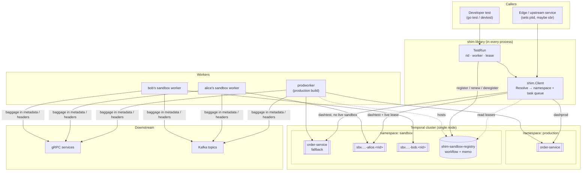
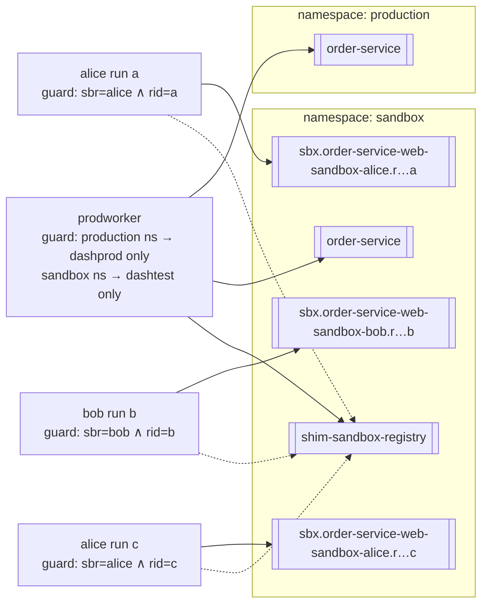
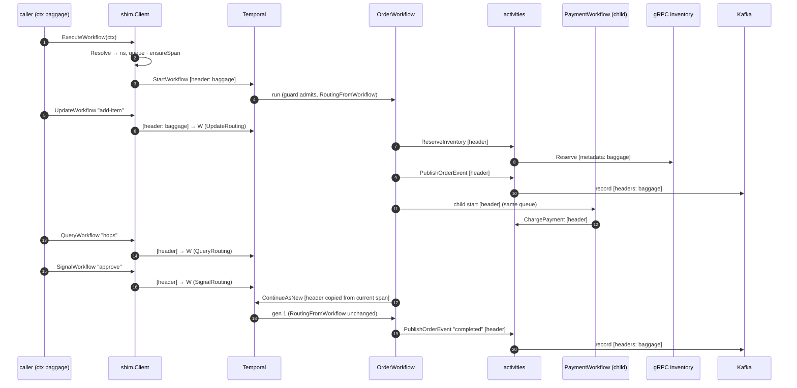
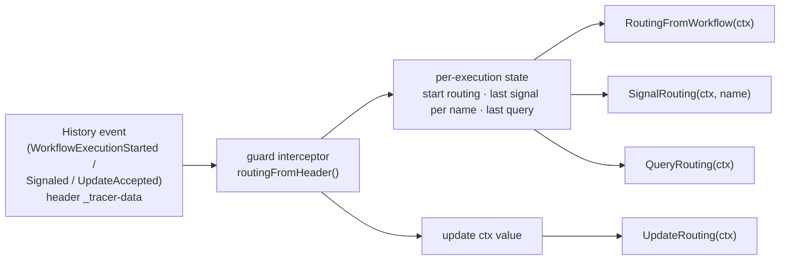
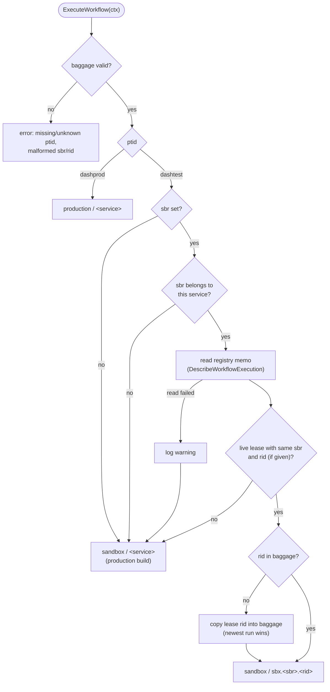
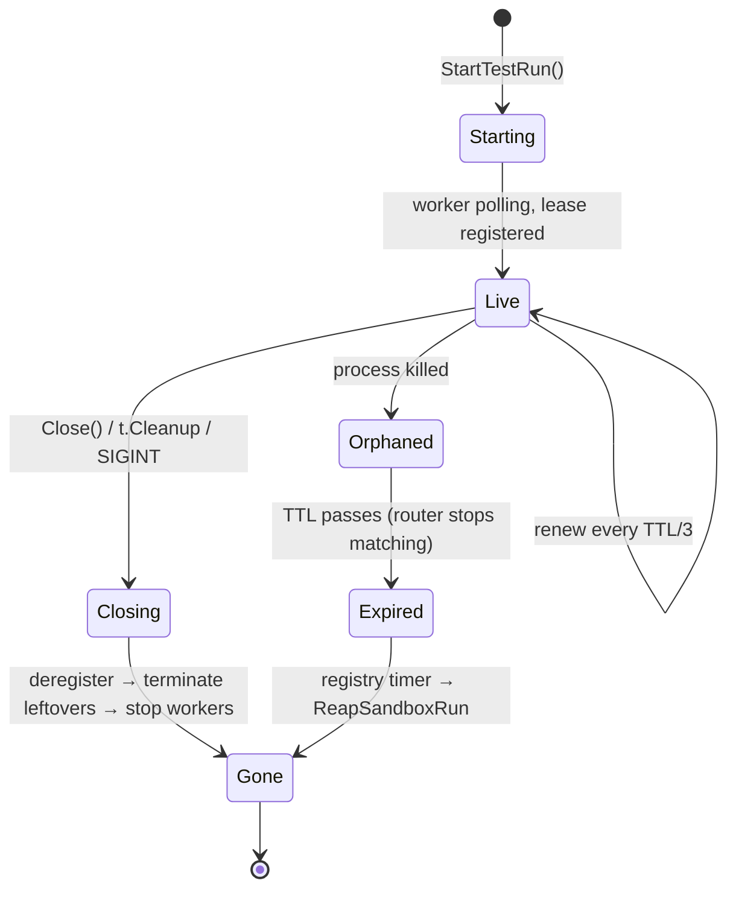
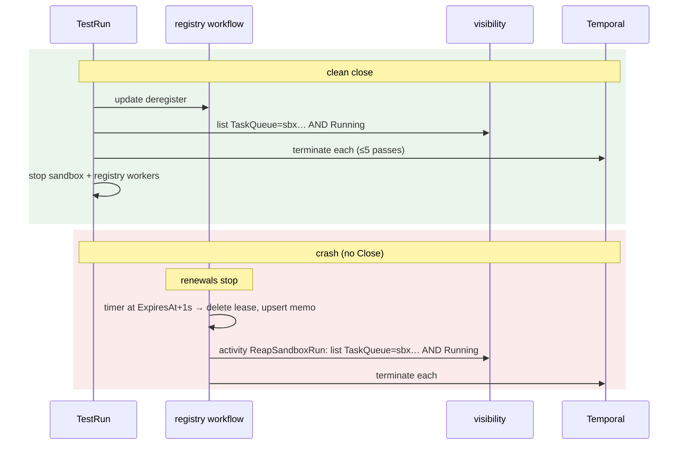
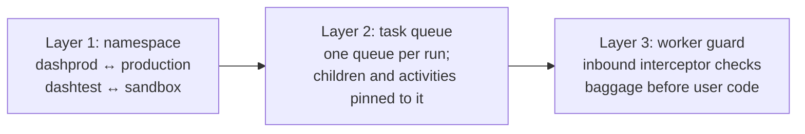
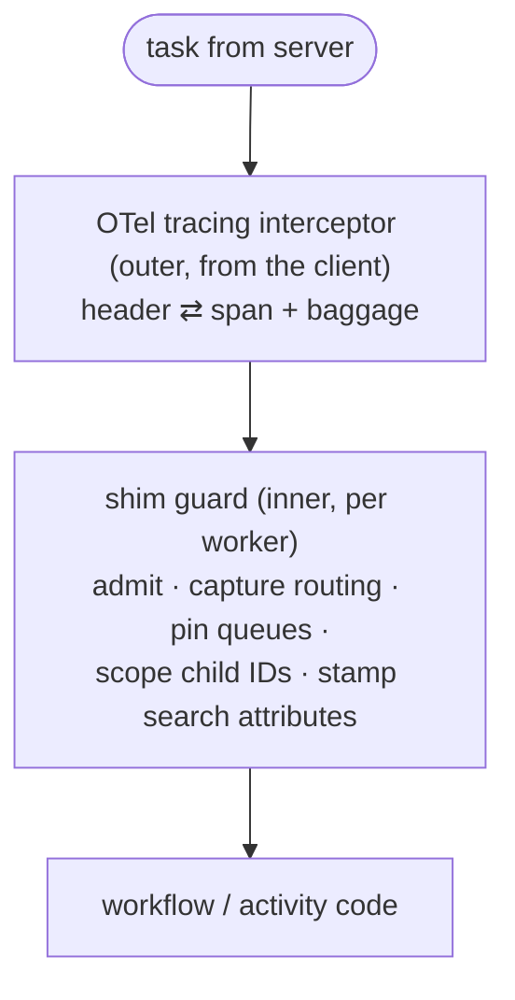

# Design: baggage-routed sandboxes on a shared Temporal cluster

| | |
|---|---|
| Status | POC implemented ([adam-quan/dd-poc](https://github.com/adam-quan/dd-poc)) |
| Scope | Temporal Go SDK, one cluster, `production` + `sandbox` namespaces |
| Companion | [README](../README.md): quick start, demo walkthrough, registry operations |

This document covers the *why* and the *shape* of the system. The README covers how to run it and the
registry's operational details.

---

## 1. Problem

Developers need to test changes to a service against realistic traffic without a private cluster each.
Several developers may test **the same service at the same time**. Neither they nor production traffic may
see each other's work.

Requests already carry OpenTelemetry baggage set at the edge:

| key | values | meaning |
|---|---|---|
| `ptid` | `dashprod` / `dashtest` | tenant: production or test traffic |
| `sbr` | `<service>-<app>-sandbox-<name>` | which developer sandbox of which service |
| `rid` | generated per test run | which run of that sandbox |

## 2. Goals and non-goals

**Goals**
- G1. Production and test traffic share one cluster but run in separate namespaces.
- G2. Routing is decided only by baggage. Callers never choose a namespace or task queue.
- G3. Baggage survives every Temporal boundary (start, activity, child, signal, update, query,
  continue-as-new) and leaves through gRPC and Kafka.
- G4. Each test run gets its own task queue and workers. These are created and destroyed automatically,
  including when the developer's process crashes.
- G5. Production work never executes on sandbox workers, and sandbox work never executes on production
  workers.
- G6. Test traffic with no live sandbox still gets served, by the production build.
- G7. Concurrent developers, and concurrent runs of the same developer, are fully isolated.

**Non-goals**
- Isolating data stores, caches or third-party side effects. Baggage is forwarded so those layers *can*
  isolate; doing so is their job.
- Cross-service routing inside a workflow. This is sketched in §10 but not built.
- Multi-cluster or Temporal Cloud specifics, beyond the notes in §10.

## 3. Architecture overview

There are three parts:
1. **Router (`shim.Client`):** reads baggage and resolves a start to a `(namespace, task queue)` pair.
2. **Run lifecycle (`TestRun`):** gives each test run a fresh `rid`, a queue, a guarded worker and a lease.
3. **Registry:** one durable workflow that records live runs, so the router can tell "sandbox is up" from
   "fall back to production".

## 4. Topology: namespaces, task queues, workers

| Queue | Namespace | Polled by | Receives |
|---|---|---|---|
| `<service>` | production | production build | all `dashprod` traffic |
| `<service>` | sandbox | production build | `dashtest` traffic with no live sandbox |
| `sbx.<sbr>.<rid>` | sandbox | that run's worker only | `dashtest` traffic matching that lease |
| `shim-sandbox-registry` | sandbox | production build + every test run | registry workflow and its reaper activity |

**Why one queue per run, not one per sandbox.** A developer may run two test sessions in parallel, for
example two terminals or CI next to a laptop. With one queue per `sbr`, the runs would steal each other's tasks.
Keying the queue on `sbr` + `rid` makes every run hermetic. It also makes cleanup trivial: everything on the
queue belongs to exactly one run.

## 5. Baggage propagation

### 5.1 Mechanism

The shim uses one OTel propagator everywhere: `TraceContext + Baggage`, W3C format.

| Boundary | Carrier | Component |
|---|---|---|
| Client → Temporal (start, signal, query, update) | Temporal header `_tracer-data` | `contrib/opentelemetry` tracing interceptor on the client |
| Workflow → activity / child / signal-external / continue-as-new | Temporal header `_tracer-data` | same interceptor, workflow outbound side |
| Activity → gRPC | gRPC metadata | `shimgrpc.UnaryClientInterceptor` / `UnaryServerInterceptor` |
| Activity → Kafka | record headers | `shimkafka.Inject` / `Extract` |

The Temporal interceptor only serializes baggage next to a **valid span context**. The shim therefore:
- installs an SDK `TracerProvider` by default (no exporter needed); and
- starts a span (`ensureSpan`) before every client call that has none.

### 5.2 End-to-end path for one order

Every arrow labelled with a header or metadata is asserted in `TestConcurrentDevelopersAndProduction`.

### 5.3 Reading baggage inside a workflow, deterministically

Workflow code must not depend on anything that can differ on replay. The shim's workflow interceptor does
**not** read baggage from the Go context. It decodes it directly from the inbound Temporal header, which is
stored in history:

Replay sees the same headers, so it gets the same answers. The e2e suite replays every history with
`Client.ReplayerOptions()`, which installs the same interceptor stack.

## 6. Routing decision

After resolving, the shim also:
- overrides `TaskQueue` in the start options, so the caller cannot misroute;
- scopes the workflow ID for `dashtest` traffic that carries a `rid` (`order-42` → `order-42@<rid>`).
  Signals, queries, updates and child or external IDs apply the same function, so business IDs stay usable;
- stamps the `Ptid`, `Sbr` and `Rid` search attributes for visibility and cleanup queries.

**Fail-safe direction.** Every uncertain case resolves to the production build in the `sandbox` namespace,
never to `production`. The worst outcome of a registry problem is "my sandbox didn't get the traffic", not
"test traffic reached production".

## 7. Test run lifecycle

### 7.1 States

The ordering on both paths is deliberate:
- **Start:** the worker polls *before* the lease exists, so no routed task waits on an unpolled queue.
- **Close:** the lease goes *before* the worker stops, so no new task lands on a queue that is about to die.

### 7.2 Clean close vs. crash

Both paths share `terminateTaskQueueWorkflows`, so they finish in the same state: no lease, no running
workflows, no pollers. Temporal has no API to delete a task queue. An unpolled queue with an empty backlog
is unloaded by the server, so that end state *is* "deleted".

## 8. Isolation model

There are three independent layers. Any one of them alone prevents the cross-tenant execution that G5 and
G7 rule out.

| Worker | Admits | On violation |
|---|---|---|
| production build, `production` ns | `ptid=dashprod` | workflow task panics: no code runs, the workflow stays parked and visible |
| production build, `sandbox` ns | `ptid=dashtest` (any or no sbr) | same |
| sandbox run worker | `ptid=dashtest` ∧ `sbr` = own ∧ `rid` = own | same; activities fail non-retryably |

`TestGuardRefusesMisroutedWorkflows` bypasses layers 1 and 2 with a raw SDK client and shows that layer 3
holds.

**Interceptor stack on a worker**

The SDK applies the client's interceptors before the worker's own, so tracing wraps the guard. The guard
reads headers directly, so its decisions would not change if the order did.

## 9. Key decisions and alternatives

| Decision | Chosen | Alternatives considered | Why |
|---|---|---|---|
| Where baggage rides | OTel `contrib/opentelemetry` interceptor + W3C baggage | custom `ContextPropagator` with its own header | One standard format end to end (Temporal, gRPC, Kafka); trace context comes for free; interoperates with other SDKs |
| Isolation unit | namespace per tenant + task queue per run | queue per sandbox; namespace per developer | Per-run queues isolate parallel runs; namespaces per developer are heavy to create, clean up and authorize |
| Liveness source | explicit lease registry | poll `DescribeTaskQueue` pollers | Pollers linger for minutes after a worker dies, can't map `sbr`→newest `rid`, and can't trigger cleanup |
| Registry storage | Temporal workflow | external KV (Redis/etcd), DB table | No new infrastructure; durable timers for expiry; serialized writes; reaping runs as an activity |
| Registry reads | memo via `DescribeWorkflowExecution` | workflow query | Queries need a live worker and stalled ~5s when the sticky worker had died; the memo is written atomically with each update |
| Fallback target | production build in `sandbox` namespace | production namespace; reject the request | Keeps `dashtest` out of `production`; still serves un-sandboxed test traffic |
| Business ID collisions | suffix `@<rid>`, applied by the shim | require unique IDs from tests | Developers reuse fixtures freely; the transform is applied consistently on every call |
| Misroute response | panic the workflow task | fail the workflow; drop | Never runs user code; the workflow is kept for diagnosis instead of being destroyed |

## 10. Risks and open questions

| Risk | Impact | Mitigation / next step |
|---|---|---|
| Single registry workflow serializes writes | Throughput ceiling at hundreds of runs | Shard by service, or move leases to an existing routing store |
| Registry read on every routed start | Extra RPC per `dashtest`+`sbr` start | ~1s client-side cache in front of `Client.Leases` |
| Partitioned live run outlives its TTL | Its workflows are reaped while it still runs | Tune `LeaseTTL`; consider a grace period before reaping |
| Long-running registry changes code | Non-determinism on replay | `workflow.GetVersion`, or terminate-and-restart (runs re-register within TTL/3) |
| Cross-service child workflows | Child would land on the parent's queue, not the other service's sandbox | Resolve in a local activity via `Client.ForService(x).Resolve`, then start with that queue |
| Kafka consumers ignore baggage | Sandbox records processed by production consumers | Consumer-side rule: sandbox consumers take only their sbr+rid; production consumers skip `dashtest` |
| Credentials | A developer client could address `production` directly | Temporal Cloud: per-namespace API keys/mTLS; developers get `sandbox` only |

## 11. Verification

| Test | Proves |
|---|---|
| `TestConcurrentDevelopersAndProduction` | G1–G3, G6, G7: five concurrent flows on one order ID; every hop's baggage, namespace, queue and worker; Kafka consumer view; replay determinism |
| `TestGuardRefusesMisroutedWorkflows` | G5: layer 3 holds when layers 1–2 are bypassed |
| `TestCloseCleansUpRun` | G4 (clean): lease withdrawn, leftovers terminated, later traffic falls back |
| `TestCrashedRunIsReaped` | G4 (crash): lease expiry + registry reaping |
| `pkg/shim` unit tests | baggage validation, header decoding, ID scoping, guard policy matrix |
